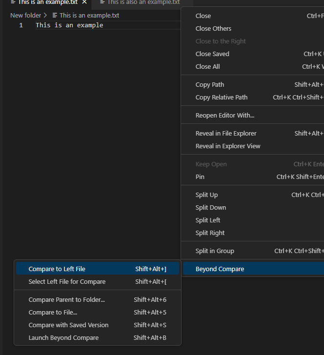
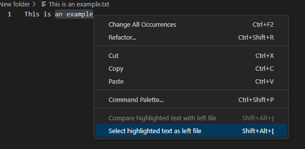
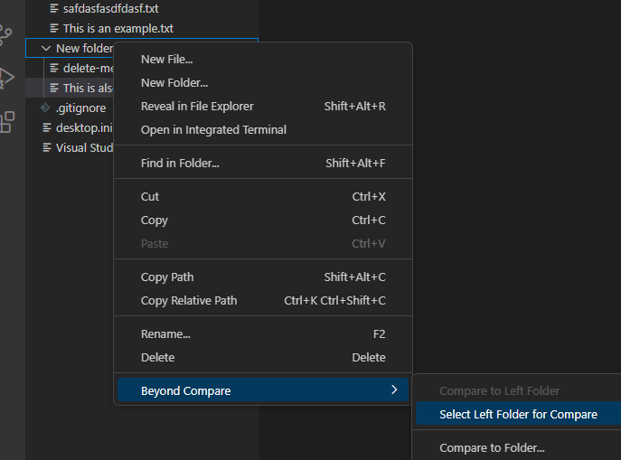
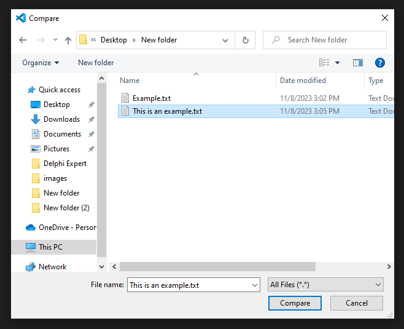
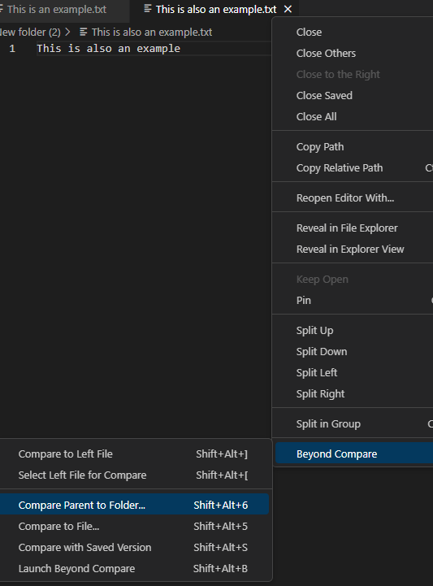
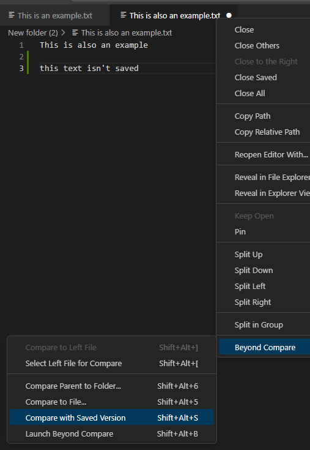
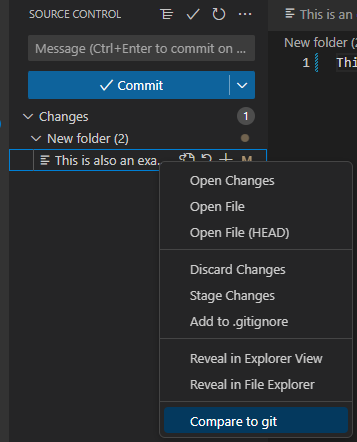

# Open files in Beyond Compare directly from VSCode

This extension allows you to open Beyond Compare directly from VSCode in several useful ways.

## Features

### Compare two open files
Use this option to select a file for compare

And then to pick another file to compare it to

You can also right click on files in the explorer

### Compare highlighted text
Use this option to select highlighted text for comparison, and then another selection of text to begin the compare

Text can also be compared to files by selcting a file for comparison first

### Compare folders
Use this option to select a folder for comparison, and then another folder to begin the compare

### Compare files to non-open files
Use this option to compare a file you pick with an open dialouge

A similar option exists for folders in the explorer

### Compare parent to folder
Use this option to chose a file and compare the folder it's in to another folder with an open dialouge

### Compare to saved version
Use this option to compare the version of a file you have open in the editor to the version stored on disk

### Compare to git repository
Use this option to compare staged or unstaged changes to the last commit in the current branch

## Requirements

Beyond Compare must be installed on your computer.

## Extension Settings

This extension assumes that Beyond Compare 4 is installed in the default location. If you have a different version installed or have it installed in a different location, update the path to Beyond Compare in settings. (`File` > `Preferences` > `Settings`)

## Known Issues

Calling out known issues can help limit users opening duplicate issues against your extension.

<!-- ## Release Notes

Users appreciate release notes as you update your extension.

### 1.0.0

Initial release of ...

### 1.0.1

Fixed issue #.

### 1.1.0

Added features X, Y, and Z.

---

## Following extension guidelines

Ensure that you've read through the extensions guidelines and follow the best practices for creating your extension.

* [Extension Guidelines](https://code.visualstudio.com/api/references/extension-guidelines)

## Working with Markdown

You can author your README using Visual Studio Code. Here are some useful editor keyboard shortcuts:

* Split the editor (`Cmd+\` on macOS or `Ctrl+\` on Windows and Linux).
* Toggle preview (`Shift+Cmd+V` on macOS or `Shift+Ctrl+V` on Windows and Linux).
* Press `Ctrl+Space` (Windows, Linux, macOS) to see a list of Markdown snippets.

## For more information

* [Visual Studio Code's Markdown Support](http://code.visualstudio.com/docs/languages/markdown)
* [Markdown Syntax Reference](https://help.github.com/articles/markdown-basics/)

**Enjoy!** -->
