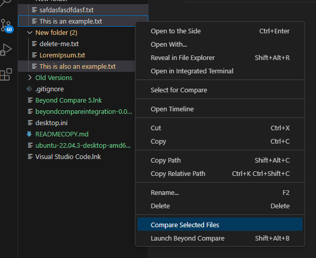
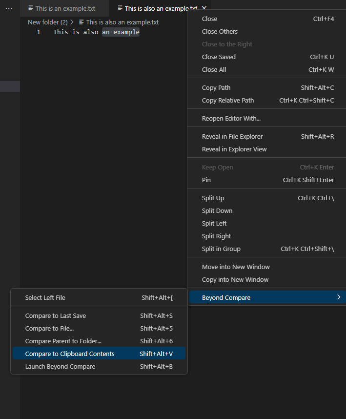
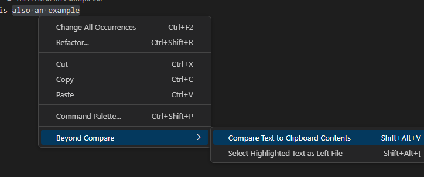
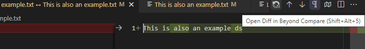
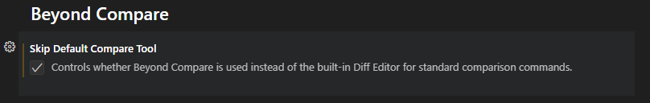

# Open files in Beyond Compare directly from VSCode

This extension allows you to open Beyond Compare directly from VSCode in several useful ways.

## Features

- [Commands](#commands)
    - [Compare two open files](#compare-two-open-files)
    - [Compare highlighted text](#compare-highlighted-text)
    - [Compare folders](#compare-folders)
    - [Compare files to non-open files](#compare-files-to-non-open-files)
    - [Compare parent to folder](#compare-parent-to-folder)
    - [Compare to saved version](#compare-to-saved-version)
    - [Compare to git repository](#compare-to-git-repository)
    - [Compare selected](#compare-selected)
    - [Compare to clipboard](#compare-to-clipboard)
    - [Open Beyond Compare from Diff Editor](#open-beyond-compare-from-diff-editor)
- [Settings](#settings)
    - [Automatically open Beyond Compare](#automatically-open-beyond-compare)
- [Requirements](#requirements)

---

## Commands

### Compare two open files
Use this option to select a file for comparison.

And then pick another file to compare it to.

You can also right-click on files in the File Explorer.

### Compare highlighted text
Use this option to select the highlighted text for comparison, and then another selection of text to begin the comparison.

Text can also be compared to files by selecting a file for comparison first.

### Compare folders
Use this option to select a folder for comparison, and then another folder to begin the comparison.

### Compare files to non-open files 
Use this option to compare a file you pick with an open dialog.

A similar option exists for folders in the File Explorer.

### Compare parent to folder
Use this option to choose a file and compare the folder it's in to another folder with an open dialog.

### Compare to saved version
Use this option to compare the version of a file you have open in the editor to the version stored on disk.

### Compare to git repository
Use this option to compare staged or unstaged changes to the last commit in the current branch.

### Compare Selected
Use this option to compare 2 selected files or folders from the File Explorer.

### Compare to Clipboard
Use this option to compare the text on your clipboard to an open file.

Or to a highlighted selection of text.

### Open Beyond Compare from Diff Editor
Use this button when you have a comparison open in VSCode to open it in Beyond Compare.

There is also a [setting](#settings) to automatically open BC whenever a comparison is opened.

## Settings

### Automatically open Beyond Compare
Use this setting to skip VSCode's built-in Diff Editor and go straight to Beyond Compare.

## Requirements

Beyond Compare must be installed on your computer.

